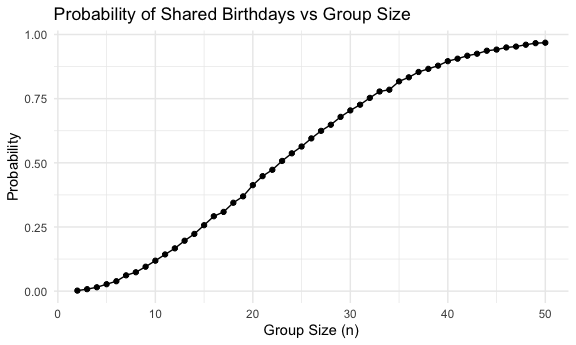
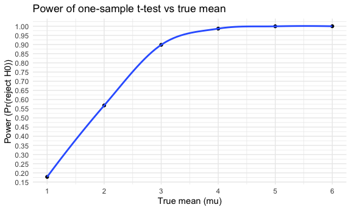
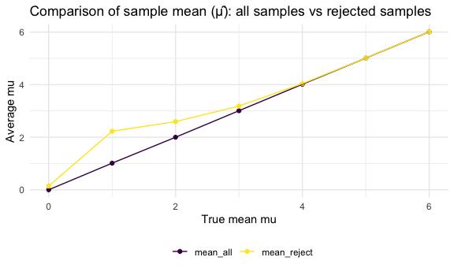
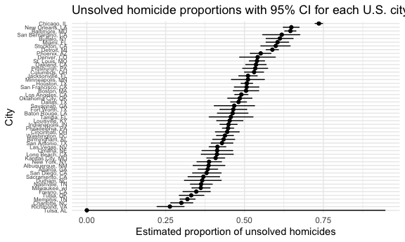

p8105_hw5_zx2527
================
Zihan Xiong
2025-11-14

# Problem 1

## writing function

``` r
bday_sim=function(n_room) {
  birthdays=sample(1:365, n_room, replace = TRUE)
  repeated_bday=length(unique(birthdays)) < n_room
  return(repeated_bday)
}
```

## check duplications

``` r
bday_sim(20)
```

    ## [1] TRUE

``` r
bday_sim_results=
  expand_grid(
    bdays=2:50,
    iter=1:10000
  ) |>
  mutate(
    results=map_lgl(bdays, bday_sim))|>
      group_by(bdays) |>
  summarise(
    prob_repeat=mean(results)
  )
```

``` r
bday_sim_results |>
  ggplot(aes(x=bdays, y=prob_repeat))+
  geom_line()+
  geom_point()+
  labs(
    title="Probability of Shared Birthdays vs Group Size",
    x="Group Size (n)",
    y="Probability"
  )
```



``` r
ggsave("birthday vs group size.png", width=8, height=6, dpi=300)
```

The plot shows the estimated probability of at least two people shared
the same birthday as the group size increases from 2 to 50. The
probability increases as the group size is increasing, indicates that
when the group is small, the probability of at least 2 people shared the
same birthday is close to 0, while the probability increases sharply as
the group size grows.

# Problem 2

## writing function

``` r
sim_mean_sd=function(mu, n_subj=30, sigma=5){
  x=rnorm(n_subj, mean=mu, sd=sigma)
  t_res=broom::tidy(t.test(x,mu=0))
  
  tibble(
    mu_true=mu,
    mu_hat=mean(x),
    p_value=t_res$p.value,
    reject=p_value<0.05
  )
}
```

``` r
sim_mean_sd(mu=0)
```

    ## # A tibble: 1 × 4
    ##   mu_true mu_hat p_value reject
    ##     <dbl>  <dbl>   <dbl> <lgl> 
    ## 1       0  -1.45   0.161 FALSE

``` r
sim_mean_sd(mu=2)
```

    ## # A tibble: 1 × 4
    ##   mu_true mu_hat p_value reject
    ##     <dbl>  <dbl>   <dbl> <lgl> 
    ## 1       2   2.14  0.0458 TRUE

``` r
sim_results_df=
  expand_grid(
    mu=1:6,
    iter=1:5000
  ) |>
  mutate(
    results=map(mu,sim_mean_sd)
  ) |>
  unnest(results)
```

``` r
power_df=
  sim_results_df |>
  group_by(mu_true) |>
  summarise(
    power=mean(reject),
    .groups = "drop"
  )
```

## make a plot for power vs true mu

``` r
power_df |>
  ggplot(aes(x=mu_true, y=power))+
  geom_point()+
  geom_smooth(se=FALSE)+
  scale_x_continuous(breaks = seq(1,6,by=1))+
  scale_y_continuous(breaks=seq(0,1,by=0.05))+
  labs(
    x="True mean (mu)",
    y="Power (Pr(reject H0))",
    title = "Power of one-sample t-test vs true mean"
  )
```

    ## `geom_smooth()` using method = 'loess' and formula = 'y ~ x'


Description:

The plot shows the power of the one-sample t-test increases
monotonically with the true value of mu. When mu=1 (when the null
hypothesis is true), the probability of rejecting the null is very close
to 0.05, which matches the nominal type I error. As mu increases from 0
to 6, the probability of rejecting null hypothesis increases. This
pattern is expected because a larger effect size produces a larger
t-statistic on average, making the test more sensitive and more likely
to detect the deviation from the null.

## plot the average mu_hat compare “all samples” vs “rejected only”

summarise the means

``` r
est_summary_df=
  sim_results_df |>
  group_by(mu_true) |>
  summarise(
    mean_all=mean(mu_hat),
    mean_reject=mean(mu_hat[reject]),
    .groups = "drop"
  )
```

``` r
est_long_df=
  est_summary_df |>
  pivot_longer(
    cols = c(mean_all, mean_reject),
    names_to = "type",
    values_to = "mu_hat_avg"
  )
```

## make a plot

``` r
est_long_df |>
  ggplot(aes(x=mu_true,y=mu_hat_avg,colour = type))+
  geom_point()+
  geom_line()+
  labs(
    x="True mean mu",
    y="Average mu",
    color="",
    title = "Comparison of sample mean (μ̂): all samples vs rejected samples"
  )
```



No, the sample average of mu_hat among tests where the null hypothesis
is rejected is not approximately equal to the true mu, especially when
the true effect size is small. This is because rejection of the null
hypothesis (p \< 0.05) tends to occur only when the observed sample mean
is unusually far from 0. When the true mean is small, only samples with
large positive deviations are likely to be significant. As a result,
conditioning on “rejecting H₀” introduces selection bias, and it
reflects the fact that statistically significant estimates tend to
overestimate the true effect when power is low.

# Problem 3

``` r
homicide_df =
  read_csv("./data/homicide-data.csv") |>
  janitor::clean_names() |>
  mutate(
    city_state=str_c(city,", ", state)
  )
```

    ## Rows: 52179 Columns: 12
    ## ── Column specification ────────────────────────────────────────────────────────
    ## Delimiter: ","
    ## chr (9): uid, victim_last, victim_first, victim_race, victim_age, victim_sex...
    ## dbl (3): reported_date, lat, lon
    ## 
    ## ℹ Use `spec()` to retrieve the full column specification for this data.
    ## ℹ Specify the column types or set `show_col_types = FALSE` to quiet this message.

``` r
homicide_df
```

    ## # A tibble: 52,179 × 13
    ##    uid        reported_date victim_last  victim_first victim_race victim_age
    ##    <chr>              <dbl> <chr>        <chr>        <chr>       <chr>     
    ##  1 Alb-000001      20100504 GARCIA       JUAN         Hispanic    78        
    ##  2 Alb-000002      20100216 MONTOYA      CAMERON      Hispanic    17        
    ##  3 Alb-000003      20100601 SATTERFIELD  VIVIANA      White       15        
    ##  4 Alb-000004      20100101 MENDIOLA     CARLOS       Hispanic    32        
    ##  5 Alb-000005      20100102 MULA         VIVIAN       White       72        
    ##  6 Alb-000006      20100126 BOOK         GERALDINE    White       91        
    ##  7 Alb-000007      20100127 MALDONADO    DAVID        Hispanic    52        
    ##  8 Alb-000008      20100127 MALDONADO    CONNIE       Hispanic    52        
    ##  9 Alb-000009      20100130 MARTIN-LEYVA GUSTAVO      White       56        
    ## 10 Alb-000010      20100210 HERRERA      ISRAEL       Hispanic    43        
    ## # ℹ 52,169 more rows
    ## # ℹ 7 more variables: victim_sex <chr>, city <chr>, state <chr>, lat <dbl>,
    ## #   lon <dbl>, disposition <chr>, city_state <chr>

``` r
nrows <-nrow (homicide_df)
```

Description for the raw data:

This dataset includes 52179 individuals and 12 variables. It includes
variables listed below:

1.  `uid`
2.  `reported_date`
3.  `victim_last`: last name of victim
4.  `victim_first`” first name of victim
5.  `victim_race`
6.  `victim_age`
7.  `victim_sex`
8.  `city`
9.  `state`
10. `lat`: latitude
11. `lon`: longitude
12. `disposition`

To summarise: closed without arrest and open/no arrest

``` r
city_summary =
  homicide_df |>
  mutate(
    unsolved = disposition %in% c("Closed without arrest", "Open/No arrest")
  ) |>
  group_by(city_state) |>
  summarise(
    total = n(),
    unsolved = sum(unsolved),
    .groups = "drop"
  )
city_summary
```

    ## # A tibble: 51 × 3
    ##    city_state      total unsolved
    ##    <chr>           <int>    <int>
    ##  1 Albuquerque, NM   378      146
    ##  2 Atlanta, GA       973      373
    ##  3 Baltimore, MD    2827     1825
    ##  4 Baton Rouge, LA   424      196
    ##  5 Birmingham, AL    800      347
    ##  6 Boston, MA        614      310
    ##  7 Buffalo, NY       521      319
    ##  8 Charlotte, NC     687      206
    ##  9 Chicago, IL      5535     4073
    ## 10 Cincinnati, OH    694      309
    ## # ℹ 41 more rows

## proportion of homicides that are unsolved

``` r
baltimore =
  city_summary |>
  filter(city_state == "Baltimore, MD")
```

``` r
baltimore_test =
  prop.test(baltimore$unsolved, baltimore$total)
```

``` r
baltimore_tidy =
  broom::tidy(baltimore_test)
```

``` r
baltimore_estimate = baltimore_tidy |> pull(estimate)
baltimore_ci_low  = baltimore_tidy |> pull(conf.low)
baltimore_ci_high = baltimore_tidy |> pull(conf.high)

baltimore_estimate
```

    ##         p 
    ## 0.6455607

``` r
baltimore_ci_low
```

    ## [1] 0.6275625

``` r
baltimore_ci_high
```

    ## [1] 0.6631599

## prop.test for each city

``` r
city_results =
  city_summary |>
  mutate(
    test = map2(unsolved, total, ~ prop.test(.x, .y)),
    test_tidy = map(test, broom::tidy)
  ) |>
  unnest(test_tidy) |>
  select(city_state, estimate, conf.low, conf.high)
city_results
```

    ## # A tibble: 51 × 4
    ##    city_state      estimate conf.low conf.high
    ##    <chr>              <dbl>    <dbl>     <dbl>
    ##  1 Albuquerque, NM    0.386    0.337     0.438
    ##  2 Atlanta, GA        0.383    0.353     0.415
    ##  3 Baltimore, MD      0.646    0.628     0.663
    ##  4 Baton Rouge, LA    0.462    0.414     0.511
    ##  5 Birmingham, AL     0.434    0.399     0.469
    ##  6 Boston, MA         0.505    0.465     0.545
    ##  7 Buffalo, NY        0.612    0.569     0.654
    ##  8 Charlotte, NC      0.300    0.266     0.336
    ##  9 Chicago, IL        0.736    0.724     0.747
    ## 10 Cincinnati, OH     0.445    0.408     0.483
    ## # ℹ 41 more rows

## make plots

``` r
city_results_plot =
  city_results |>
  arrange(estimate) |>
  mutate(
    city_state = factor(city_state, levels = city_state)
  )
```

``` r
city_results_plot |>
  ggplot(aes(x = estimate, y = city_state)) +
  geom_point() +
  geom_errorbar(aes(xmin = conf.low, xmax = conf.high), width = 0.2) +
  labs(
    x = "Estimated proportion of unsolved homicides",
    y = "City",
    title = "Unsolved homicide proportions with 95% CI for each U.S. city"
  ) +
  theme_minimal()+
  theme(
  axis.text.y = element_text(size = 6)   
)
```



``` r
ggsave("city_plot.pdf", width = 8, height = 15)
```
