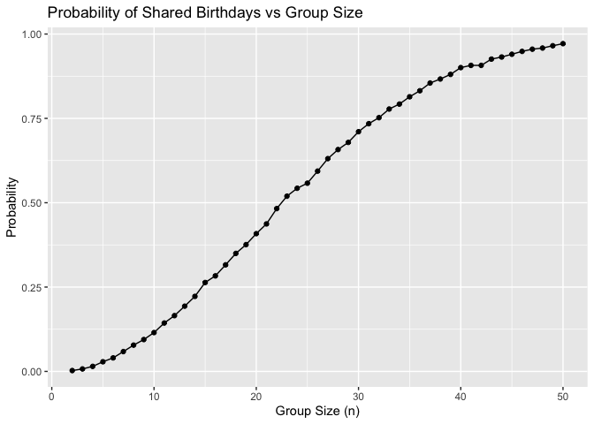

p8105_hw5_zx2527
================
Zihan Xiong
2025-11-14

# Problem 1

``` r
library(tidyverse)
```

    ## ── Attaching core tidyverse packages ──────────────────────── tidyverse 2.0.0 ──
    ## ✔ dplyr     1.1.4     ✔ readr     2.1.5
    ## ✔ forcats   1.0.0     ✔ stringr   1.5.1
    ## ✔ ggplot2   3.5.2     ✔ tibble    3.3.0
    ## ✔ lubridate 1.9.4     ✔ tidyr     1.3.1
    ## ✔ purrr     1.1.0     
    ## ── Conflicts ────────────────────────────────────────── tidyverse_conflicts() ──
    ## ✖ dplyr::filter() masks stats::filter()
    ## ✖ dplyr::lag()    masks stats::lag()
    ## ℹ Use the conflicted package (<http://conflicted.r-lib.org/>) to force all conflicts to become errors

``` r
one_bir=function(n) {
  birthdays=sample(1:365, n, replace = TRUE)
  any(duplicated(birthdays))
}
```

## check duplications

``` r
one_bir(10)
```

    ## [1] FALSE

Yes, there are duplications.

``` r
replicate_one_n=function(n) {
  results=map_dbl(1:10000, ~one_bir(n))
  mean(results)
}
```

``` r
n_list= 2:50
probabilities=
  tibble(
    n=n_list,
    prob=map_dbl(n_list, replicate_one_n)
  )
probabilities
```

    ## # A tibble: 49 × 2
    ##        n    prob
    ##    <int>   <dbl>
    ##  1     2 0.00250
    ##  2     3 0.00730
    ##  3     4 0.0149 
    ##  4     5 0.0286 
    ##  5     6 0.0401 
    ##  6     7 0.0588 
    ##  7     8 0.0779 
    ##  8     9 0.0944 
    ##  9    10 0.115  
    ## 10    11 0.143  
    ## # ℹ 39 more rows

``` r
probabilities |>
  ggplot(aes(x=n, y=prob))+
  geom_line()+
  geom_point()+
  labs(
    title="Probability of Shared Birthdays vs Group Size",
    x="Group Size (n)",
    y="Probability"
  )
```

<!-- -->

``` r
ggsave("birthday vs group size.png", width=8, height=6, dpi=300)
```
